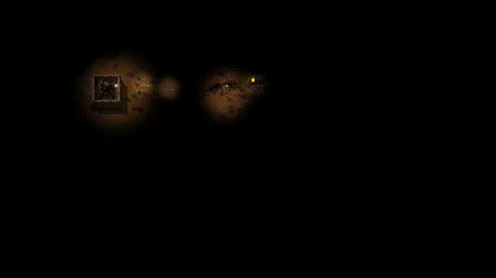
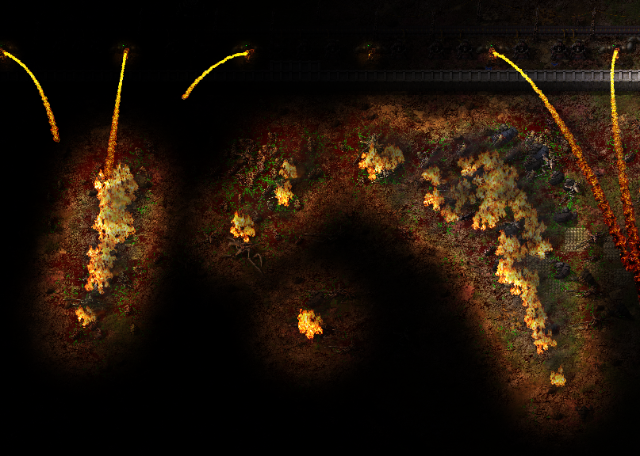
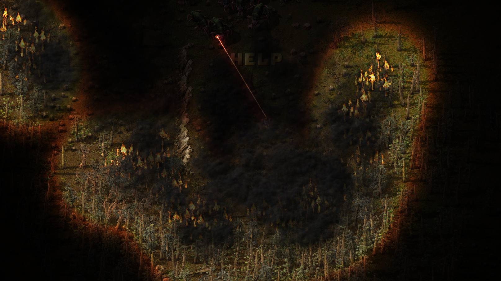
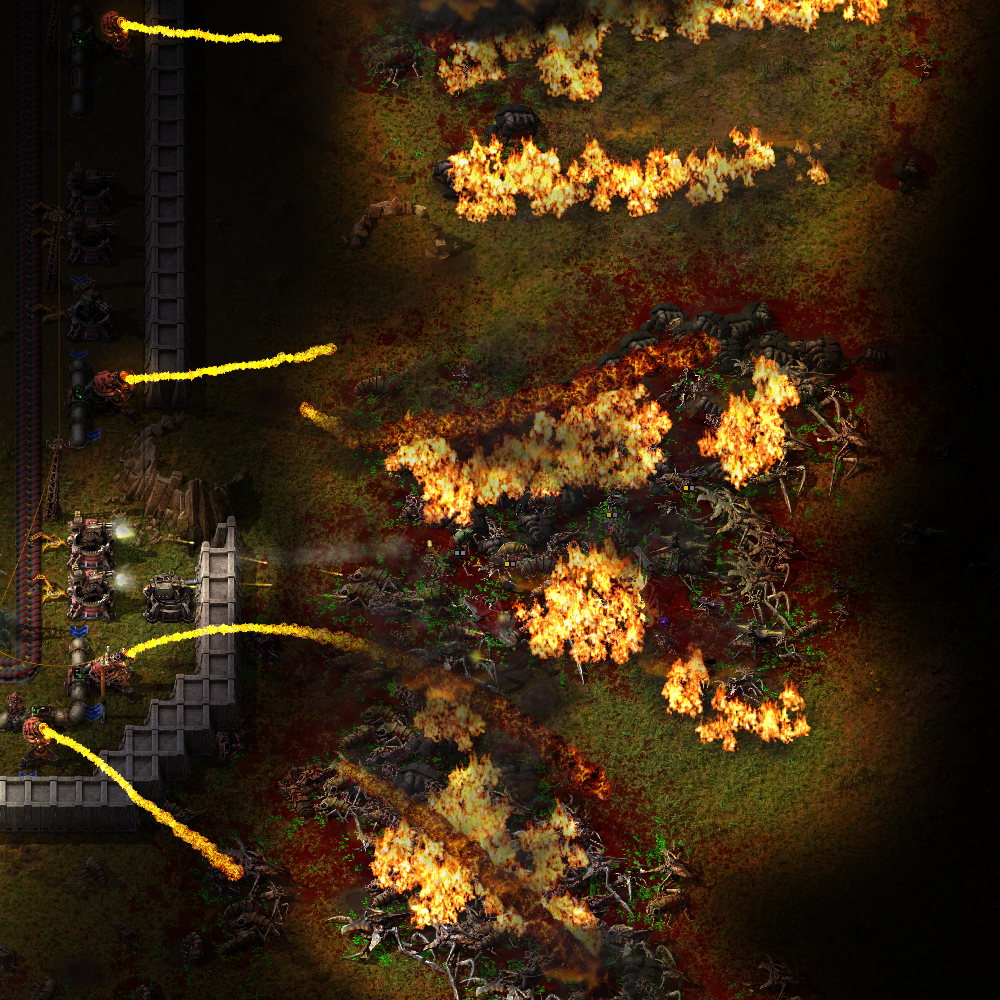
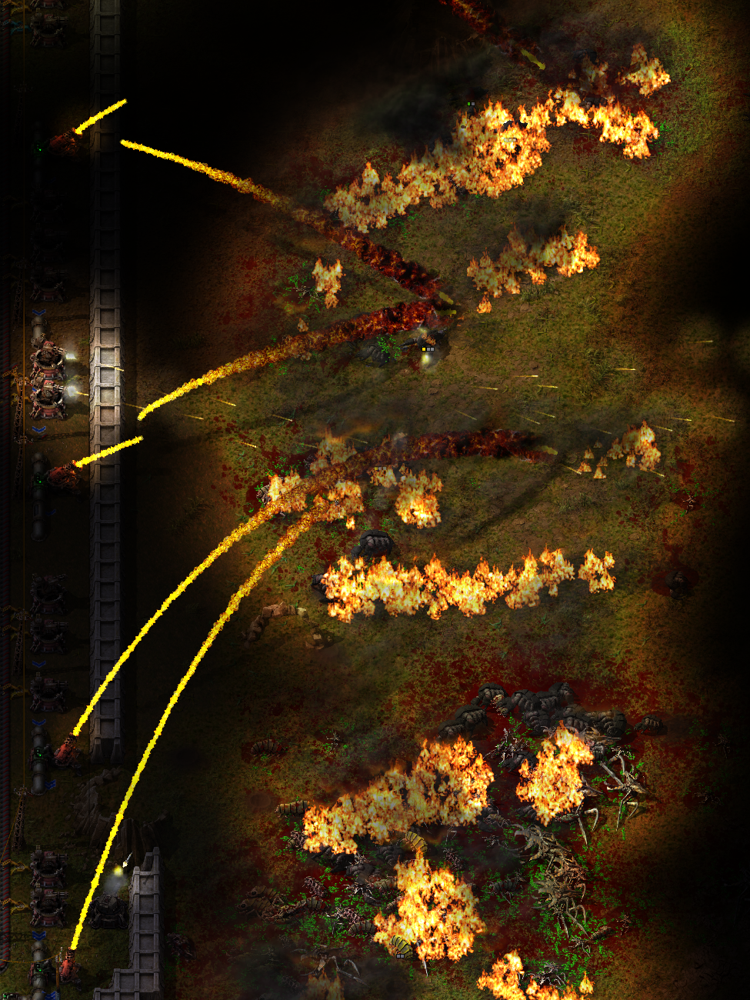

# Dynamic Ambient Lighting

Adds dynamic light sources to fires, explosions, muzzle flashes, bullet projectiles, and more! 

> [!TIP]
> For a truly intense and mildly horrifying gameplay experience, try using this mod in combination with **Distant Misfires** and very dark **Diurnal Dynamics** nights.

---

## Previews

  
  

  
  

---

## Features

* **Dynamic Environment Lights:** Fires, most explosions, and most projectiles act as real, dynamic light sources.
* **Weapon Effects:** Guns and turrets feature realistic muzzle flashes, and flamethrowers have custom idle pilot lights.
* **Intelligent Scaling:** All light sources are dynamically colored and sized based on the entity generating them.
* **Enhanced Scale:** Dramatically increased light radius and intensity from rocket launches.
* **Hardcore Immersion Options:** 
  * Option to stop biters from showing up on your minimap.
  * Option to disable the minimap entirely at night.
  * Optional built-in nightvision changes to prevent it from washing out the atmosphere and rendering the mod pointless.
* **Customization:** Highly configurable settings, including fully customizable flashlight sizes.
* **Mod Compatibility:** Seamless built-in compatibility with other mods (Rocket turrets look amazing!).

---

## Performance Impact

### Runtime Scripting
The runtime script code in this mod is **completely disabled** unless you explicitly turn on the mod option to *disable the minimap at night*. Otherwise, it has zero impact on your UPS.

### Graphics Performance
There is a reason Wube doesn't add all of these light sources out of the box, and it is related to rendering overhead. However, if you have a dedicated graphics card, you should not run into any issues.

> [!NOTE]  
> If you experience FPS drops or are struggling with performance, you can completely disable individual light types in the **Startup Settings** by changing any of the **Light Size Multiplier** options to `0`. This completely removes those specific light sources and eliminates their rendering cost.

---

## Community & Support

* Join the community on [Discord](https://discord.gg/Y82Pj635Rx) to chat, report issues, or share screenshots!